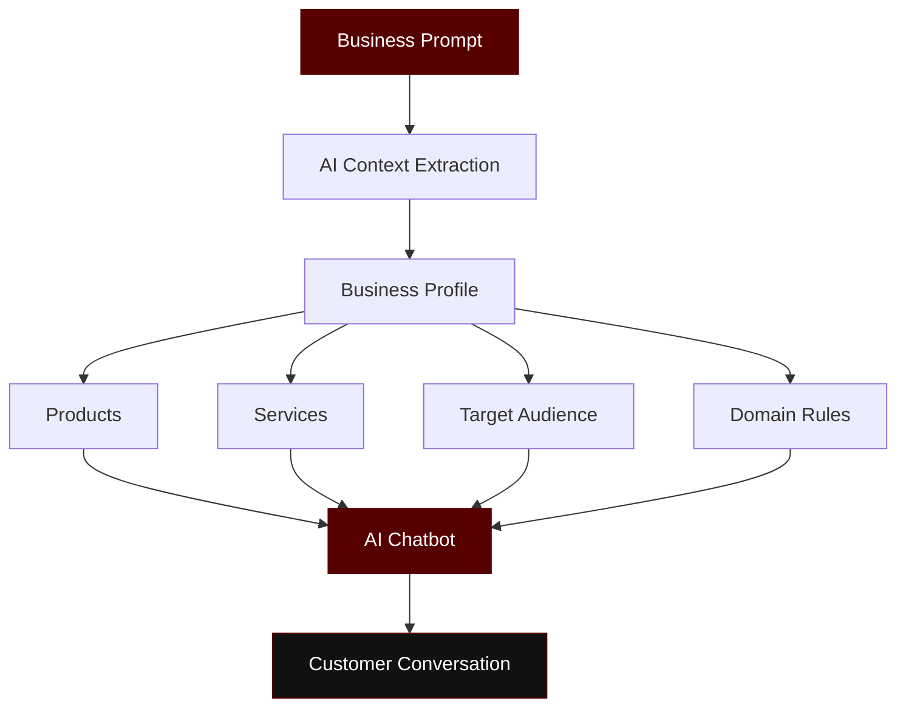
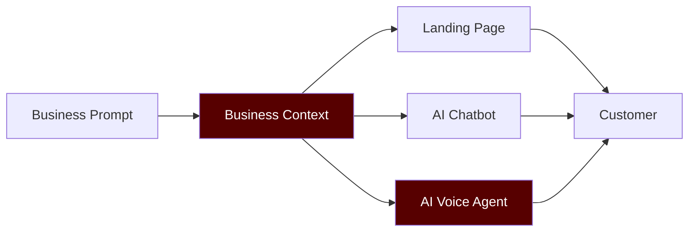
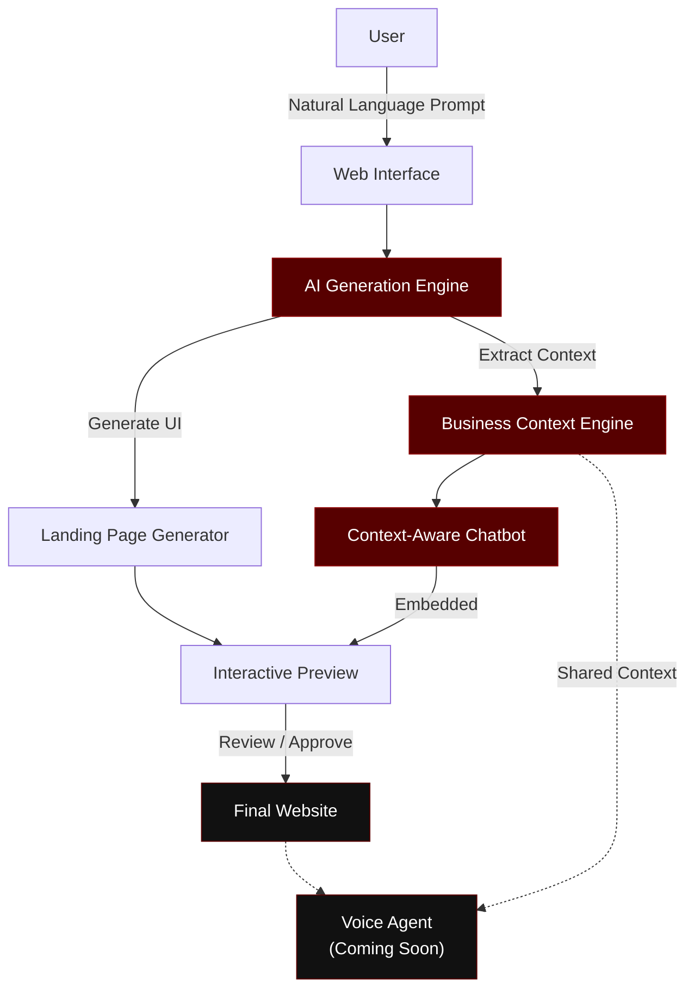
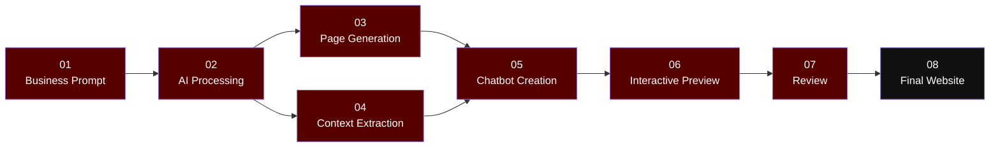

<p align="center">
<strong> AI Landing Page Generator </strong>
</p>

<p align="center">
  
  
  
  
  
</p>

<p align="center">
  <strong>Describe a business. Generate its website. Give it an AI that understands the business.</strong>
</p>

<p align="center">
  An AI-powered landing page generator that transforms natural-language business descriptions into responsive websites with context-aware AI customer support.
</p>

<br />

<p align="center">
  
</p>

---

## Overview

The **AI Landing Page Generator** is designed to go beyond traditional website builders.

A user simply describes their business in natural language, and the system generates a complete landing page while simultaneously extracting the underlying business context to create a specialized AI customer-support experience.

For example:

> **"Create a modern website for an auto workshop specializing in aftermarket performance parts."**

The system can generate:

```text
Business Prompt
      │
      ▼
┌─────────────────────┐
│   AI Generation     │
└──────────┬──────────┘
           │
     ┌─────┴─────┐
     ▼           ▼
Landing Page   Business Context
     │           │
     │           ▼
     │      AI Chatbot
     │           │
     └─────┬─────┘
           ▼
    Intelligent Website
```

The result is not just a webpage.

It is a **business-specific digital experience**.

---

# Core Features

## 01 — Prompt-to-Page Generation

Describe the business in plain language and let the AI generate a complete landing page.

```text
"Luxury barber shop in Lahore
with premium grooming services"
                ↓
        AI Generation Engine
                ↓
     ┌────────────────────┐
     │ Hero Section       │
     │ Services           │
     │ About              │
     │ Testimonials       │
     │ CTA                │
     │ Contact            │
     └────────────────────┘
```

The generated interface is designed to be responsive and visually polished across desktop and mobile devices.

---

## 02 — Context-Aware AI Chatbot

The chatbot isn't a generic assistant.

It receives the **business context extracted from the original generation prompt**.



### Example

If the website was generated for an auto workshop, the chatbot can answer questions such as:

```text
Customer:
"Do you have performance exhaust systems?"

AI:
"Yes. We specialize in aftermarket performance
exhaust systems. I can help you explore the
available options."

Customer:
"What's the weather today?"

AI:
"That's outside my business scope. I can help
with questions about our automotive products
and services."
```

This provides **domain-aware responses instead of unrestricted generic conversations**.

---

# 03 — Intelligent Page Preview

Generated websites can be reviewed before finalizing them.

### Preview Modes

```text
┌─────────────────────────────────────────────┐
│                                             │
│              Generated Website              │
│                                             │
│   ┌─────────────────────────────────────┐   │
│   │                                     │   │
│   │         Landing Page Preview        │   │
│   │                                     │   │
│   │          + AI Chatbot               │   │
│   │                                     │   │
│   └─────────────────────────────────────┘   │
│                                             │
│     [ Preview ] [ Fullscreen ] [ New Tab ]  │
│                                             │
└─────────────────────────────────────────────┘
```

Users can inspect the generated experience before approving the final result.

---

# 04 — Modern Animated UI

The interface is designed around a **minimal dark aesthetic with deep maroon accents**, subtle gradients, glass surfaces, and motion-based interactions.

### Design Principles

```text
Minimal
   +
Dark
   +
Glass
   +
Motion
   +
AI
   =
Premium Interface
```

### Animation System

Powered by **Framer Motion**, the application uses:

* Smooth page transitions
* Fade and slide animations
* Staggered component reveals
* Interactive hover states
* Animated gradients
* Glassmorphism effects
* Floating UI elements
* Micro-interactions
* Loading animations
* Chatbot transitions

The animations are intentionally subtle so that motion enhances the interface without distracting from the generated content.

---

# 05 — Voice Agent

### Coming Soon

The next stage of the project is a **conversational AI Voice Agent**.

The architecture is designed to extend the same business context used by the chatbot into a real-time voice experience.



The long-term vision is:

```text
               BUSINESS PROMPT
                      │
                      ▼
              ┌───────────────┐
              │ Business AI   │
              │    Context    │
              └───────┬───────┘
                      │
          ┌───────────┼───────────┐
          ▼           ▼           ▼
      WEBSITE      CHATBOT    VOICE AGENT
          │           │           │
          └───────────┼───────────┘
                      ▼
              CUSTOMER EXPERIENCE
```

---

# System Architecture



---

# End-to-End Workflow



---

# Technology Stack

<div align="center">

| Layer        | Technology             |
| ------------ | ---------------------- |
| Framework    | **Next.js 16**         |
| UI           | **React 19**           |
| Styling      | **Tailwind CSS v4**    |
| Animation    | **Framer Motion**      |
| Icons        | **Lucide React**       |
| Testing      | **Vitest**             |
| Architecture | **Next.js App Router** |

</div>

---

# Project Architecture

```text
ai-landing-page/
│
├── app/
│   ├── components/
│   ├── api/
│   ├── page.tsx
│   └── layout.tsx
│
├── components/
│   ├── generator/
│   ├── preview/
│   ├── chatbot/
│   └── ui/
│
├── lib/
│   ├── ai/
│   ├── context/
│   └── utilities/
│
├── public/
│   └── assets/
│
├── tests/
│
├── package.json
└── README.md
```

---

# Design Language

The visual system follows a restrained color palette:

```text
Primary
#570000

Dark
#0A0A0A

Surface
#111111

Border
#242424

Text
#F5F5F5

Muted
#8A8A8A
```

The objective is to keep the interface **minimal and professional**, using color primarily for emphasis rather than decoration.

---

# Product Philosophy

Traditional landing-page generators focus primarily on:

```text
Prompt
  ↓
Website
```

This project aims to evolve that workflow into:

```text
                  ┌─────────────┐
                  │   Prompt    │
                  └──────┬──────┘
                         ↓
                ┌────────────────┐
                │ Business AI    │
                │    Context     │
                └───────┬────────┘
                        ↓
          ┌─────────────┼─────────────┐
          ↓             ↓             ↓
      WEBSITE        CHATBOT       VOICE
          │             │             │
          └─────────────┼─────────────┘
                        ↓
              Intelligent Business
                  Experience
```

The goal is to transform **AI website generation from a design-generation problem into an intelligent customer-experience platform**.

---

# Roadmap

```text
[x] AI Landing Page Generation
[x] Responsive Page Preview
[x] Context Extraction
[x] Context-Aware Chatbot
[x] Chatbot Integration
[x] Interactive Preview
[x] Fullscreen Preview

[ ] Advanced Business Memory
[ ] Persistent Conversations
[ ] Analytics
[ ] Multi-Agent Support
[ ] Real-Time Voice Agent
[ ] Voice-to-Voice Customer Support
[ ] Production Deployment
```

---

# Getting Started

### 1. Clone the repository

```bash
git clone https://github.com/mfaaizi/Landing-page-generator.git
cd Landing-page-generator
```

### 2. Install dependencies

```bash
npm install
```

### 3. Configure environment variables

Create a `.env.local` file:

```env
AI_API_KEY=your_api_key
```

### 4. Start the development server

```bash
npm run dev
```

Open:

```text
http://localhost:3000
```

---

# Testing

Run the test suite with:

```bash
npm run test
```

---

# Vision

The future of website generation isn't simply:

> **"Generate me a website."**

It is:

> **"Understand my business and build its digital customer experience."**

This project is an exploration of that idea—combining **generative UI, contextual AI, conversational interfaces, and eventually real-time voice agents** into a single workflow.

---

<p align="center">

### Built with AI, Next.js & a lot of experimentation.

<br/>

**Prompt → Generate → Understand → Interact**

</p>
